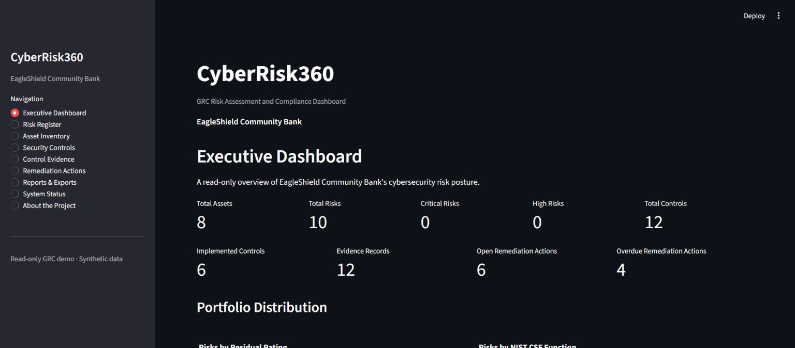

# CyberRisk360

**Trace cyber risk from assets and controls to evidence, remediation, and executive reporting.**

[](https://github.com/k-Darshan-chowdary/CyberRisk360/actions/workflows/ci.yml)


[](LICENSE)

CyberRisk360 is a cybersecurity governance, risk, and compliance (GRC) reference application built with Python and Streamlit. It connects five validated registers in a read-only interface so you can explore risk exposure, review control coverage, identify evidence and remediation priorities, and download management reports.

[Quick start](#quick-start) · [Demo walkthrough](docs/DEMO.md) · [Methodology](docs/risk_methodology.md) · [Contributing](CONTRIBUTING.md) · [Roadmap](docs/ROADMAP.md)

The included scenario follows **EagleShield Community Bank**, an entirely fictional organization. All records are synthetic. The application is intended for local evaluation, demonstrations, and development with sample data.



*Actual local application with bundled synthetic data. Time-based results use the fixed reference date 2026-08-05.*

## What you can do

| Workflow | Current capability |
| --- | --- |
| Asset inventory | Explore assets, owners, criticality, and linked risks and controls. |
| Risk assessment | Review calculated inherent and residual risk, compare rating bands, and filter the risk register. |
| Control mapping | Review safeguards mapped to assets and risks, with NIST CSF function labels. |
| Evidence tracking | Inspect evidence metadata, storage references, review status, and expiration dates. |
| Remediation | Review ownership, priority, completion, and due dates for actions linked to risks or controls. |
| Executive reporting | View summaries, relationship coverage, priority tables, and charts; download Markdown, CSV, and ZIP reports. |
| Project health | Check sample-data integrity, relationships, exports, configuration, and dependency pins. |

The sample contains **8 assets, 10 risks, 12 controls, 12 evidence records, and 10 remediation actions**. Nine pages cover the Executive Dashboard, Risk Register, Asset Inventory, Security Controls, Control Evidence, Remediation Actions, Reports & Exports, System Status, and About the Project.

## Quick start

Use **Git and Python 3.13**, matching the CI environment. No API keys, external accounts, or database setup are required to run locally.

```sh
git clone https://github.com/k-Darshan-chowdary/CyberRisk360.git
cd CyberRisk360
```

**Windows PowerShell or Command Prompt**

```powershell
py -3.13 -m venv .venv
.venv\Scripts\python.exe -m pip install -r requirements.txt
.venv\Scripts\python.exe -m streamlit run app.py
```

**macOS or Linux**

```sh
python3.13 -m venv .venv
.venv/bin/python -m pip install -r requirements.txt
.venv/bin/python -m streamlit run app.py
```

Open the local URL printed by Streamlit, normally `http://localhost:8501`. Start with the **Executive Dashboard**, follow a risk through its related records, then open **Reports & Exports** to download the results. See the [demo walkthrough](docs/DEMO.md) for a guided tour.

You can also [read an example executive report](docs/examples/executive-report.md) generated from the included data without installing the application.

There is no verified public demo URL in the repository. [Deployment instructions](DEPLOYMENT.md) describe how to host the sample application; they do not indicate that an instance is already live.

## How the model works

```text
Assets <-- Risks <-- Controls <-- Evidence metadata
             ^           ^
             +-----------+
              Remediation

Validated CSV registers --> Reporting engine --> Markdown / CSV / ZIP
                       --> Streamlit pages   --> Filters / charts / details
Integrity manifest + project checks          --> System Status
```

Arrows between registers indicate references: a risk references an asset; controls map to assets and risks; evidence references a control; remediation can reference a risk or control.

- **Inherent score:** likelihood × impact, with each input an integer from 1 to 5.
- **Residual score:** `round(inherent_score × (1 − control_effectiveness_pct / 100), 2)`.
- **Rating bands:** Low below 8, Medium from 8 to below 15, High from 15 to below 20, and Critical from 20 through 25.

The risk record's effectiveness percentage is an estimate supplied with that assessment. It is **not automatically derived from linked controls or evidence**. NIST CSF labels organize risks and controls by function; they are not a complete framework mapping or proof of compliance. See [risk methodology](docs/risk_methodology.md) and the [data dictionary](docs/data_dictionary.md).

The UI and reports use a fixed reference date of **2026-08-05** for reproducible evidence-expiration and overdue-action results. They do not represent live monitoring. Evidence records contain metadata and storage references; the application does not collect or store evidence attachments.

## Reports and validation

The Download Center provides five CSV registers, an executive Markdown report, and a complete ZIP package. The ZIP contains seven files: those five registers, the executive report, and a text manifest. Exports are generated in memory. PDF export is not implemented.

Run the same quality gates used by [GitHub Actions](.github/workflows/ci.yml) from the repository root, using the virtual environment's Python:

```powershell
# Windows
.venv\Scripts\python.exe -m pytest -q
.venv\Scripts\python.exe integrity_guard.py
.venv\Scripts\python.exe project_health.py
```

```sh
# macOS / Linux
.venv/bin/python -m pytest -q
.venv/bin/python integrity_guard.py
.venv/bin/python project_health.py
```

Tests cover register behavior, risk scoring, reporting, exports, integrity, project health, and all nine Streamlit routes. Eight health checks examine required files, loading, sample counts, relationships, integrity, reporting/exports, Streamlit configuration, and exact direct-dependency pins.

SHA-256 checks detect sample CSV changes against the versioned integrity manifest. They do not establish data authenticity or application security. The five CSVs use LF line endings across platforms.

## Scope and security

The current interface is read-only. Backend register modules expose file-management functions for development, but the UI does not provide record editing or uploads. There is no authentication, authorization, production database, durable audit log, live service integration, or encryption-at-rest implementation.

Use synthetic data only. CyberRisk360 has not been penetration-tested or certified and is not ready to handle real banking, personal, or confidential information. Reporting supports discussion and prioritization; it does not establish regulatory compliance.

Read the [security policy](SECURITY.md) before reporting a vulnerability and the [deployment guide](DEPLOYMENT.md) before hosting an instance.

## Documentation and contribution

| Resource | Start here for |
| --- | --- |
| [Demo walkthrough](docs/DEMO.md) | A short evaluation path through the sample scenario |
| [Risk methodology](docs/risk_methodology.md) | Scoring inputs, calculations, and thresholds |
| [Data dictionary](docs/data_dictionary.md) | Fields, values, and register relationships |
| [Asset and control workflow](docs/asset_control_workflow.md) | Backend behavior and mappings |
| [Evidence and remediation workflow](docs/evidence_remediation_workflow.md) | Validation, status, and date handling |
| [Reporting and exports](docs/reporting_exports_workflow.md) | Report contents and export behavior |
| [Contributing](CONTRIBUTING.md) | Setup, contribution scope, and validation |
| [Roadmap](docs/ROADMAP.md) | Proposed improvements and current boundaries |
| [Public launch checklist](docs/PUBLIC_LAUNCH.md) | Repository metadata and release preparation |

Bug reports, documentation improvements, regression tests, and focused usability changes are welcome. [Open an issue](https://github.com/k-Darshan-chowdary/CyberRisk360/issues/new/choose) with a reproducible example or discuss a larger change before implementation.

Earlier phase documents, including the [Phase 1 scope](docs/project_scope.md), record the project's development history. This README describes the current application.

## License

CyberRisk360 is available under the [MIT License](LICENSE). You may use, copy,
modify, and distribute the software subject to the license terms. The software is
provided without warranty.
